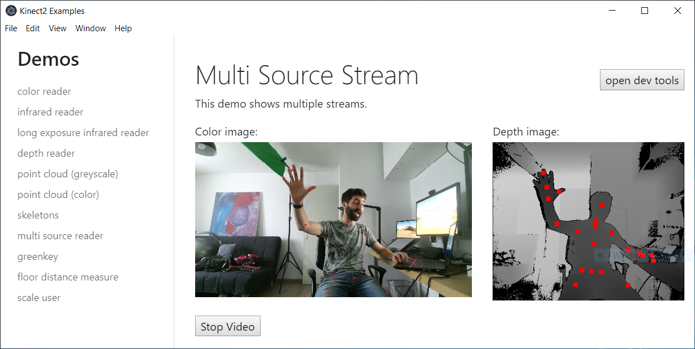

# Kinect2 Library for Node / Electron

[](https://www.paypal.com/cgi-bin/webscr?cmd=_donations&business=NUZP3U3QZEQV2&currency_code=EUR&source=url)

This library enables you to use the Kinect v2 in your nodejs or electron apps.



Features:

- get rgb camera feed
- get depth feed
- get ir feed
- point cloud (greyscale and colored)
- get skeleton joints (2d and 3d)
- user masking

## Installation

You will need to install [the official Kinect 2 SDK](https://www.microsoft.com/en-us/download/details.aspx?id=44561) before you can use this module.

Just npm install like you would do with any regular module. 

```
$ npm install kinect2
```

There are no precompiled binaries yet, so you need to have [node-gyp installed on your system](https://github.com/nodejs/node-gyp).

## Examples

There are nodejs and electron examples in the examples/ folder of this repo. To run them, execute npm install and npm start:

```
$ cd examples/electron
$ npm install
$ npm start
```

The electron examples have the javascript code inside the html files. You can find these html files in [examples/electron/renderer/demos](examples/electron/renderer/demos).

## Donate

Like this library? Always welcome to buy me a beer 🍺

[](https://www.paypal.com/cgi-bin/webscr?cmd=_donations&business=NUZP3U3QZEQV2&currency_code=EUR&source=url)